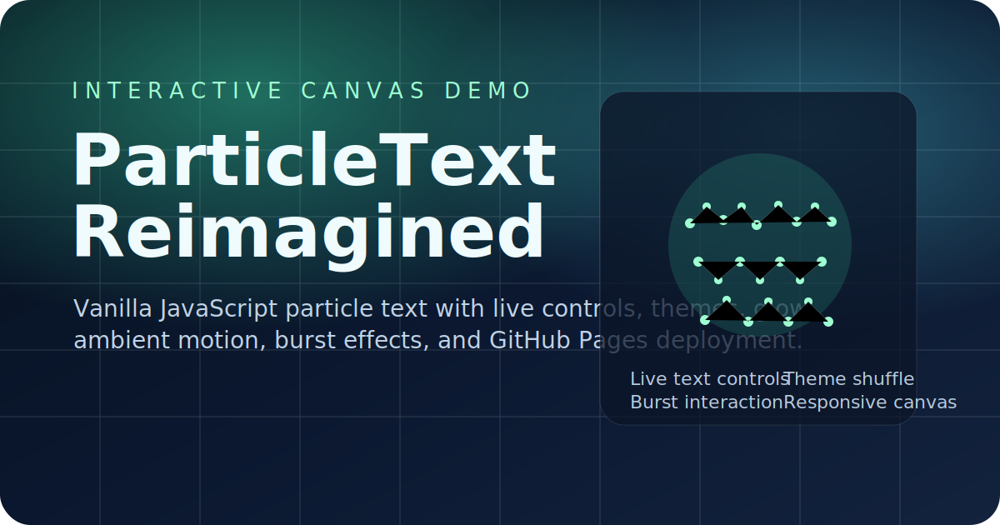

# ParticleText Reimagined

[](https://phani06041.github.io/particletext-reimagined/)
[](https://developer.mozilla.org/en-US/docs/Web/JavaScript)
[](https://developer.mozilla.org/en-US/docs/Web/API/Canvas_API)
[](https://github.com/phani06041/particletext-reimagined/actions)

A polished, interactive particle-text experience built with vanilla JavaScript and the HTML5 Canvas API. No frameworks, no build step, and no dependencies — just a lightweight front end that feels playful, fast, and instantly deployable.



## Why This Project Exists

This project started as a rebuild inspired by the ParticleText idea, but the goal was not just to copy the effect. The aim was to turn it into a cleaner, more presentable demo with stronger visual polish, better interactivity, GitHub-ready deployment, and a landing page feel that is easy to share publicly.

It is designed to be approachable for beginners, lightweight for quick experiments, and visually strong enough to work as a portfolio-style front-end canvas project.

## Overview

ParticleText Reimagined turns text into a living field of animated particles. Type into the interface and the canvas redraws your words as a glowing particle formation. Move your cursor through the composition to push particles away, switch between color themes, adjust the interaction feel, and trigger a burst animation for a more dramatic effect.

Because the project is fully static, it runs locally with a simple file open or a tiny local server and deploys cleanly to GitHub Pages.

## Live Demo

- Site: https://phani06041.github.io/particletext-reimagined/
- Repo: https://github.com/phani06041/particletext-reimagined

## Feature Highlights

- Interactive particle text rendered on an HTML5 canvas
- Real-time text redraw with editable input
- Pointer-based particle repulsion with smooth spring-back motion
- Theme presets with one-click shuffling
- Adjustable particle density, pointer radius, and glow intensity
- Optional constellation-style links between nearby particles
- Ambient background particle layer for extra depth
- Quick text preset chips for instant demos
- Burst interaction for a fast scatter-and-return effect
- Responsive layout for desktop and mobile screens
- Custom SVG favicon and branded project preview art
- Automatic deployment through GitHub Pages

## Controls

### Text Controls

- Type a word or short phrase in the text field
- Click `Redraw` to regenerate the particle layout
- Use the preset chips to switch text instantly
- Toggle `Auto-cycle showcase words` to rotate through demo text

### Visual Controls

- Change `Theme` to switch the color palette
- Adjust `Density` for fewer or more particles
- Adjust `Glow Intensity` to change the center bloom
- Toggle `Show constellation links` to enable or disable connecting lines

### Interaction Controls

- Move the cursor across the canvas to repel particles
- Adjust `Pointer Radius` to control the interaction area
- Click `Trigger Burst` for a quick global scatter effect
- Use `Shuffle Theme` for a fast palette change

## Technical Notes

### Rendering Model

The text is rasterized to an off-screen canvas, sampled by alpha, and converted into particle target positions. Each visible particle stores:

- a current position
- an origin position
- a velocity vector
- a per-particle color and size

### Motion System

Particles are animated with a simple spring-and-friction model:

- particles accelerate toward their origin positions
- pointer interaction adds repulsion force inside a configurable radius
- friction smooths the motion and prevents jitter

### Performance Approach

The project stays lightweight by using:

- a single canvas for rendering
- `requestAnimationFrame` for the animation loop
- capped particle counts during text generation
- a dependency-free static architecture

## Project Structure

```text
particletext-reimagined/
├── .github/workflows/deploy.yml
├── app.js
├── favicon.svg
├── index.html
├── preview-card.svg
├── README.md
└── styles.css
```

## Run Locally

You can open `index.html` directly in a browser, but serving it locally is a better dev experience.

```bash
cd /Users/phanindra/Madmaxx/particletext-reimagined
python3 -m http.server 8000
```

Then visit `http://localhost:8000`.

## Deploy to GitHub Pages

This repo already includes a GitHub Pages workflow.

1. Push changes to `main`
2. Open the repository settings
3. In `Pages`, set `Source` to `GitHub Actions`
4. GitHub will publish the site automatically on future pushes

## Future Ideas

Good next upgrades for this project would be:

- smoother text-to-text morphing transitions
- exportable theme presets
- mobile-specific performance tuning
- a faux-3D or layered depth effect
- downloadable screenshots or loop captures

---

## 👤 Author

**Phanindra AKA Maxx** — Built with ❤️ · Local & Free

---

## License

MIT
